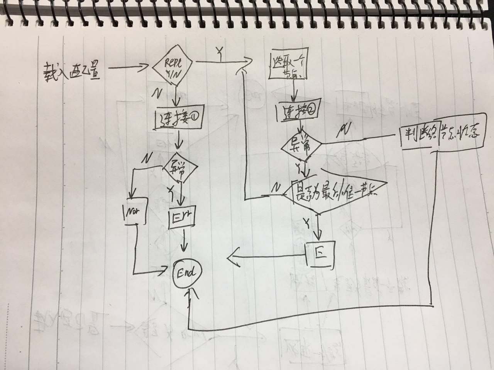

# 监控mongo的状态逻辑示意图  

# config.conf的填写规范  
*logpath* : 日志输出路径  
*loglevel* : 日志级别  
*push_path*: push数据的路径,默认我指定了open-falcon  

*type* : 监控的类型,single 单机模式,repl 副本集模式.  
*mach_list*: 监控机器列表,repl仅需提供一个列表即可,后续由程序主动获取拓扑并写会配置文件.

# 监控说明

* 本版本目前支持端口以及mongo副本集的监控.
* 副本监控,仅需提供一个节点:primary,sec,abirt均可.会根据该节点获取repl 相关拓扑并写会配置文件.
